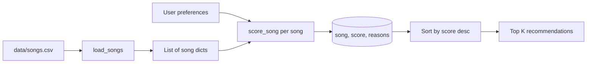

# Music Recommender Simulation

## Project summary

This repo is a tiny, transparent recommender: each song is a row of tags and numbers, and a “user” is just a few preferences in a dictionary. The program scores every track with simple weighted rules, sorts highest-first, and prints why each pick earned its points. There is no machine learning—only arithmetic—which makes it easier to see how choices in weighting and data shape what feels “personalized.”

Real apps like Spotify blend **collaborative filtering** (what similar listeners do) with **content-based** signals (tempo, mood, audio features). This simulation stays content-only: it never learns from other users, so it is closer to “find songs that look like what you said you like on paper.”

---

## How the system works

**Features on each song (from `data/songs.csv`):**  
`id`, `title`, `artist`, `genre`, `mood`, `energy` (0–1), `tempo_bpm`, `valence`, `danceability`, `acousticness`, plus extended fields **`popularity` (0–100)**, **`release_decade`**, pipe-separated **`mood_tags`**, **`lyric_theme`**, and **`language`**. Optional prefs like `target_popularity`, `target_decade`, `favorite_mood_tags`, `lyric_theme`, and `language` turn those columns into extra score terms (see `score_song` in `src/recommender.py`).

**User profile (two shapes in this project):**  
- CLI / functional style: dict keys like `genre`, `mood`, `energy`, `likes_acoustic`, and optionally `target_valence`, `target_danceability`.  
- Tests / OOP style: `UserProfile(favorite_genre, favorite_mood, target_energy, likes_acoustic)` which maps to the same scoring core.

**Scoring recipe (current defaults in `src/recommender.py`):**  
- **Genre match:** +2.0 if the user’s genre aligns with the song’s genre (substring match counts so “pop” still relates to “indie pop”).  
- **Mood match:** +1.0 for an exact mood string match (case-insensitive).  
- **Energy alignment:** up to +2.0 from \(1 - |energy_{song} - energy_{user}|\), so closeness matters—not “higher is always better.”  
- **Optional:** valence and danceability alignment if you add those keys to the prefs dict.  
- **Production vs acoustic:** if `likes_acoustic` is set, we add up to ~1.2 based on whether the track is acoustic or produced.

**Ranking:** `recommend_songs` scores the whole catalog, sorts by model score, then optionally runs a **diversity pass** so repeat artists/genres are penalized when filling the top *K*. Terminal output uses **`tabulate`** tables that include the full **reasons** string.

### Optional extensions (challenges)

| # | What |
|---|------|
| **1 – Advanced features** | Five new CSV columns with math: popularity alignment, decade proximity, overlapping mood tags, lyric theme match, language match. |
| **2 – Scoring modes** | Strategy-style `ModeMultipliers`: `balanced`, `genre_first`, `mood_first`, `energy_focused` (see `SCORING_MODES` in `recommender.py`). `main.py` compares modes for the first profile. |
| **3 – Diversity** | Greedy top-*K* with `DEFAULT_ARTIST_REPEAT_PENALTY` / `DEFAULT_GENRE_REPEAT_PENALTY` so a second pick from the same artist/genre has to “earn back” the slot. |
| **4 – Table output** | `tabulate` GitHub-style tables: `#`, Title, Artist, Score, Reasons. |

### Data flow (Mermaid)



### Algorithm recipe (plain English)

1. Load every row and convert numbers to floats so we can subtract and compare.  
2. For one user, loop each song and add points for category matches and for “how close” continuous features are.  
3. Sort all songs by total points and take the first *K*.  
4. Attach the reason strings so the ranking is explainable in the terminal.

**Bias note baked into this design:** genre is the heaviest discrete bump. If the catalog is uneven—lots of pop, little classical—a pop-leaning profile will keep seeing the same corner of the library even when mood and energy fit something else.

---

## Getting started

### Setup

```bash
cd ai110-module3show-musicrecommendersimulation-starter
python3 -m venv .venv
source .venv/bin/activate   # Windows: .venv\Scripts\activate
pip install -r requirements.txt
```

### Run the CLI

From the **project root** (the folder that contains `data/` and `src/`):

```bash
python -m src.main
```

You should see `Loaded songs: 18` and several labeled profile blocks.

### Run tests

```bash
pytest
```

---

## Sample terminal output

You can paste a real screenshot into your write-up if your course asks for it; here is what I get locally after a fresh run (titles, scores, and reasons):

```
Loaded songs: 18

High-energy pop (default)
=============================
  • Sunrise City  |  score 5.94
    genre match (+2.0); mood match (+1.0); energy alignment (+1.96; gap 0.02 from target 0.80); prefers produced/electric (+0.98)

  • Rooftop Lights  |  score 5.70
    genre match (+2.0); mood match (+1.0); energy alignment (+1.92; gap 0.04 from target 0.80); prefers produced/electric (+0.78)
```

*(Run `python -m src.main` on your machine for the full multi-profile printout.)*

---

## Experiments you tried

**Weight shift (documented rerun):** In `recommender.py`, the weights are module-level constants. For a sensitivity check, I temporarily set `WEIGHT_GENRE_MATCH` to `1.0` and `WEIGHT_ENERGY_ALIGNMENT` to `4.0`, re-ran `python -m src.main`, and the “High-energy pop” list leaned harder on whoever matched the 0.8 energy target—even when another track had a stronger genre fit. That was expected: I traded off “stay in my lane” against “match the BPM/energy feel.”

**Feature removal thought experiment:** Commenting out the mood check (not left that way in the repo) mostly shuffles the middle of the list while leaving energy-heavy pop tracks near the top, which suggested mood was doing real work for separating “happy” from “intense” pop.

---

## Limitations and risks

- Fifteen–twenty tracks is not a music service; gaps in genre are really gaps in what the recommender can ever surface.  
- Lyrics, culture, novelty, and “people like you” are absent—everything is a filter bubble you hand-designed.  
- Substring genre matching helps small catalogs but can accidentally glue unrelated tags if names get sloppy.

Details and evaluation notes live in [`model_card.md`](model_card.md) and [`reflection.md`](reflection.md).

---

## Reflection (short)

Building this made the Spotify/TikTok black box feel smaller: ranking is often “add weighted features, sort, done.” The uncomfortable part is how quickly a +2 on genre drowns out subtler signals if the data is skewed. I used the editor and tests to sanity-check the CSV typing and the sort order; for weights I still trusted my own ears and a couple of fake user profiles more than a generic suggestion list.

See the model card for a fuller write-up and personal notes.
